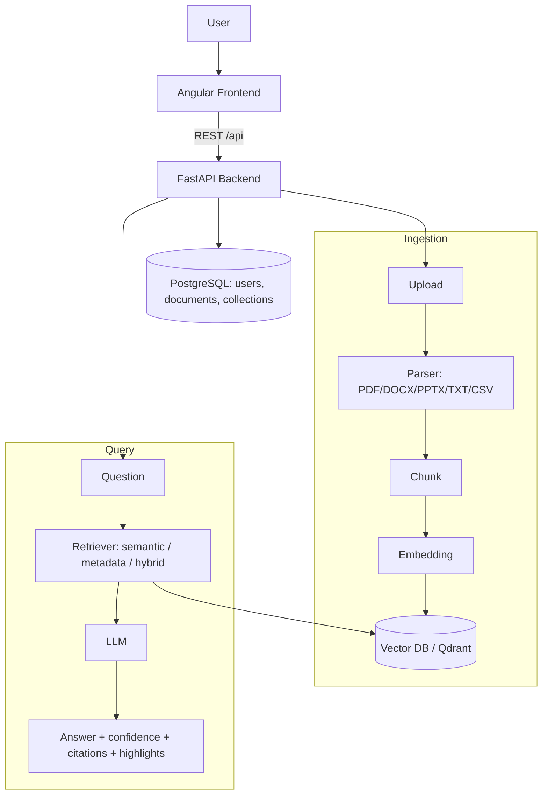

# Enterprise RAG Knowledge Assistant

An internal company knowledge system built on Retrieval-Augmented Generation (RAG). Upload documents, index them into a vector database, ask questions in natural language, and get answers with confidence scores, citations, highlighted supporting text, and links back to the source document. Multi-user, with collections and admin controls.

> Status: scaffold. This repository currently contains skeleton and boilerplate only. Feature logic is marked with `TODO` comments.

## Architecture



Pipeline: Upload to Parser to Chunk to Embedding to Vector DB to Retriever to LLM to Answer.

## Folder Structure

```
enterprise-rag-knowledge-assistant/
├── backend/                  FastAPI backend
│   ├── app/
│   │   ├── main.py           App entrypoint + /health
│   │   ├── core/config.py    Settings (pydantic-settings)
│   │   ├── api/routes/       auth, documents, search, collections, analytics, admin
│   │   ├── ingest/           parser, chunk, embed
│   │   ├── store/            vector_store (Qdrant)
│   │   ├── retrieve/         retriever, hybrid
│   │   ├── generate/         llm, answer (confidence/citation/highlight)
│   │   ├── models/           SQLAlchemy models
│   │   ├── schemas/          Pydantic schemas
│   │   └── db/session.py     DB engine/session
│   ├── requirements.txt
│   ├── Dockerfile
│   └── .env.example
├── frontend/                 Angular frontend
│   ├── src/app/pages/        login, dashboard, documents, search, collections, analytics, admin
│   ├── src/app/services/     API service wrappers
│   ├── package.json
│   ├── angular.json
│   └── tsconfig.json
├── docker-compose.yml        db, qdrant, backend, frontend
├── LICENSE
└── README.md
```

## Installation Guide

Prerequisites: Docker and Docker Compose.

```bash
git clone https://github.com/ranjan-del/enterprise-rag-knowledge-assistant.git
cd enterprise-rag-knowledge-assistant

# Configure backend environment
cp backend/.env.example backend/.env
# edit backend/.env with your DB, Qdrant, and LLM settings

# Bring up the full stack (db, qdrant, backend, frontend)
docker compose up
```

Services once running:

| Service  | URL                     |
| -------- | ----------------------- |
| Frontend | http://localhost:4200   |
| Backend  | http://localhost:8000   |
| API docs | http://localhost:8000/docs |
| Qdrant   | http://localhost:6333   |
| Postgres | localhost:5432          |

## Features

- Multi-format upload and parsing: PDF, DOCX, PPTX, TXT, CSV
- Ingestion pipeline: parse, chunk, embed, store in vector DB
- Search: semantic, metadata filter, and hybrid, organized into collections
- Cited answers: answer text with confidence, citations, highlighted text, and source document
- Dashboard: documents, users, search, analytics, collections
- Admin: upload, delete, versioning, permissions
- Auth and user management with roles and permissions

## Screenshots

_Coming soon_

## Demo GIF

_Coming soon_

## API Documentation

Interactive docs are served by FastAPI at `/docs` (Swagger) and `/redoc` once the backend is running.

| Method | Endpoint                              | Description                          |
| ------ | ------------------------------------- | ------------------------------------ |
| GET    | `/health`                             | Service health probe                 |
| POST   | `/api/auth/login`                     | Authenticate and receive a token     |
| POST   | `/api/auth/register`                  | Register a new user                  |
| GET    | `/api/auth/me`                        | Current authenticated user           |
| GET    | `/api/documents`                      | List documents                       |
| POST   | `/api/documents/upload`               | Upload a document (triggers ingest)  |
| GET    | `/api/documents/{id}`                 | Get document detail                  |
| DELETE | `/api/documents/{id}`                 | Delete a document                    |
| POST   | `/api/search/query`                   | Ask a question, get a cited answer   |
| POST   | `/api/search/semantic`                | Semantic search                      |
| POST   | `/api/search/hybrid`                  | Hybrid search                        |
| GET    | `/api/collections`                    | List collections                     |
| POST   | `/api/collections`                    | Create a collection                  |
| GET    | `/api/analytics/overview`             | Dashboard summary counts             |
| GET    | `/api/admin/users`                    | List users (admin)                   |

## Hosting

Intended live deployment (see the project plan):

- Frontend (Angular): Firebase Hosting. Serves the built app and rewrites `/api` calls to the backend host.
- Backend (FastAPI): Cloud Run or Render (Docker-native).
- PostgreSQL: Neon or Supabase free tier.
- Vector DB: Qdrant Cloud or pgvector on Neon.

## Future Improvements

- Reranking and query expansion for higher retrieval quality
- Streaming answers and inline citation navigation
- Role-based access control at the collection and document level
- Document versioning with diff view
- Redis caching (Upstash) for hot queries
- Evaluation harness for answer quality and grounding

## License

MIT. See [LICENSE](./LICENSE). Copyright (c) 2026 ranjan-del.
