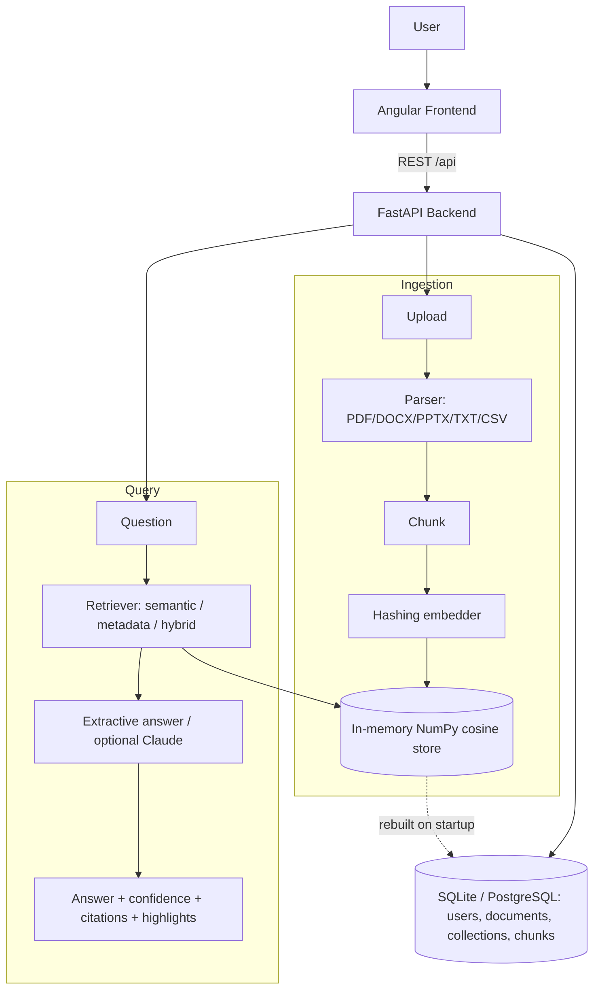

# Enterprise RAG Knowledge Assistant

An internal company knowledge system built on Retrieval-Augmented Generation (RAG). Upload documents, index them, ask questions in natural language, and get answers with confidence scores, citations, highlighted supporting text, and links back to the source document. Multi-user, with collections and admin controls.

> Status: working. The FastAPI backend and Angular frontend are fully implemented and run end to end. The default path is **offline-first**: a deterministic hashing embedder, an in-memory NumPy cosine vector store, and an extractive answer generator mean the whole system runs and its tests pass with **no API key and no external services**. Set `ANTHROPIC_API_KEY` to optionally enable generated (non-extractive) answers.

## Architecture



Pipeline: Upload to Parser to Chunk to Embedding to Vector store to Retriever to Answer. Chunk embeddings are persisted in the database, and the in-memory index is rebuilt from them on startup.

## Folder Structure

```
enterprise-rag-knowledge-assistant/
├── backend/                  FastAPI backend
│   ├── app/
│   │   ├── main.py           App entrypoint, CORS, startup (init DB, seed admin, warm index)
│   │   ├── deps.py           Auth dependencies (current user, role guard)
│   │   ├── core/             config (pydantic-settings), security (bcrypt + JWT)
│   │   ├── api/routes/       auth, documents, search, collections, analytics, admin
│   │   ├── ingest/           parser, chunk, embed, pipeline (parse->chunk->embed->index)
│   │   ├── store/            vector_store (in-memory NumPy cosine store)
│   │   ├── retrieve/         retriever (semantic), hybrid (lexical + semantic)
│   │   ├── generate/         answer (confidence/citation/highlight), llm (offline + Claude)
│   │   ├── models/           SQLAlchemy models (user, collection, document, chunk, query log)
│   │   ├── schemas/          Pydantic schemas
│   │   └── db/session.py     DB engine/session
│   ├── tests/                pytest suite (offline ingest + query + API)
│   ├── requirements.txt
│   ├── Dockerfile
│   └── .env.example
├── frontend/                 Angular frontend (standalone components)
│   ├── src/app/pages/        login, dashboard, documents, search, collections, analytics, admin
│   ├── src/app/services/     typed API clients
│   ├── src/app/interceptors/ auth token interceptor
│   ├── src/app/guards/       auth + admin route guards
│   ├── nginx.conf            serves the SPA and proxies /api to the backend
│   ├── package.json
│   ├── angular.json
│   └── tsconfig.json
├── .github/workflows/ci.yml  CI: backend pytest + frontend ng build
├── docker-compose.yml        db (Postgres), backend, frontend
├── LICENSE
└── README.md
```

## Installation Guide

### Option A — Docker (full stack)

Prerequisites: Docker and Docker Compose.

```bash
git clone https://github.com/ranjan-del/enterprise-rag-knowledge-assistant.git
cd enterprise-rag-knowledge-assistant

# Bring up the full stack (Postgres, backend, frontend)
docker compose up --build
```

### Option B — Local development (offline, no Docker)

Prerequisites: Python 3.11+ and Node 20+. No API key or database server needed.

```bash
# Backend (defaults to a local SQLite file + offline embedder)
cd backend
python -m venv .venv && source .venv/bin/activate
pip install -r requirements.txt
pytest                                   # run the test suite
uvicorn app.main:app --reload            # serve the API on :8000

# Frontend (in another terminal)
cd frontend
npm install
npm start                                # serve the app on :4200
```

Services once running:

| Service  | URL                        |
| -------- | -------------------------- |
| Frontend | http://localhost:4200      |
| Backend  | http://localhost:8000      |
| API docs | http://localhost:8000/docs |
| Postgres | localhost:5432 (Docker)    |

A bootstrap admin is seeded on first startup: `admin@example.com` / `adminpass123` (configurable via `FIRST_ADMIN_EMAIL` / `FIRST_ADMIN_PASSWORD`). New users can also self-register from the login screen.

## Features

- Multi-format upload and parsing: PDF, DOCX, PPTX, TXT, CSV
- Ingestion pipeline: parse, chunk, embed, persist, and index (offline, deterministic)
- Search: semantic, metadata filter, and hybrid (lexical + semantic fusion), scoped to collections
- Cited answers: answer text with confidence, numbered citations, highlighted supporting text, and source document
- Dashboard: documents, collections, indexed chunks, users, and query activity
- Admin: user roles and activation, document versioning, admin-override delete
- Auth and user management with JWT and two-role RBAC (admin / user)
- Offline-first: runs and tests with no API key or external service; optional Claude backend for generated answers

## Screenshots

_Not captured (headless build environment). Run the app locally (see Installation) to view the login, dashboard, documents, and Ask pages._

## Demo GIF

_Not captured (headless build environment)._

## API Documentation

Interactive docs are served by FastAPI at `/docs` (Swagger) and `/redoc` once the backend is running.

| Method | Endpoint                              | Description                          |
| ------ | ------------------------------------- | ------------------------------------ |
| GET    | `/health`                             | Service health probe                 |
| POST   | `/api/auth/login`                     | Authenticate and receive a token     |
| POST   | `/api/auth/register`                  | Register a new user                  |
| GET    | `/api/auth/me`                        | Current authenticated user           |
| GET    | `/api/documents`                      | List documents                       |
| POST   | `/api/documents/upload`               | Upload a document (triggers ingest)  |
| GET    | `/api/documents/{id}`                 | Get document detail                  |
| DELETE | `/api/documents/{id}`                 | Delete a document                    |
| POST   | `/api/search/query`                   | Ask a question, get a cited answer   |
| POST   | `/api/search/semantic`                | Semantic search                      |
| POST   | `/api/search/hybrid`                  | Hybrid search                        |
| GET    | `/api/collections`                    | List collections                     |
| POST   | `/api/collections`                    | Create a collection                  |
| GET    | `/api/analytics/overview`             | Dashboard summary counts             |
| GET    | `/api/admin/users`                    | List users (admin)                   |

## Hosting

Intended live deployment (see the project plan):

- Frontend (Angular): Firebase Hosting. Serves the built app and rewrites `/api` calls to the backend host.
- Backend (FastAPI): Cloud Run or Render (Docker-native).
- PostgreSQL: Neon or Supabase free tier.
- Vector DB: Qdrant Cloud or pgvector on Neon.

## Future Improvements

- Reranking and query expansion for higher retrieval quality
- Streaming answers and inline citation navigation
- Role-based access control at the collection and document level
- Document versioning with diff view
- Redis caching (Upstash) for hot queries
- Evaluation harness for answer quality and grounding

## License

MIT. See [LICENSE](./LICENSE). Copyright (c) 2026 ranjan-del.
