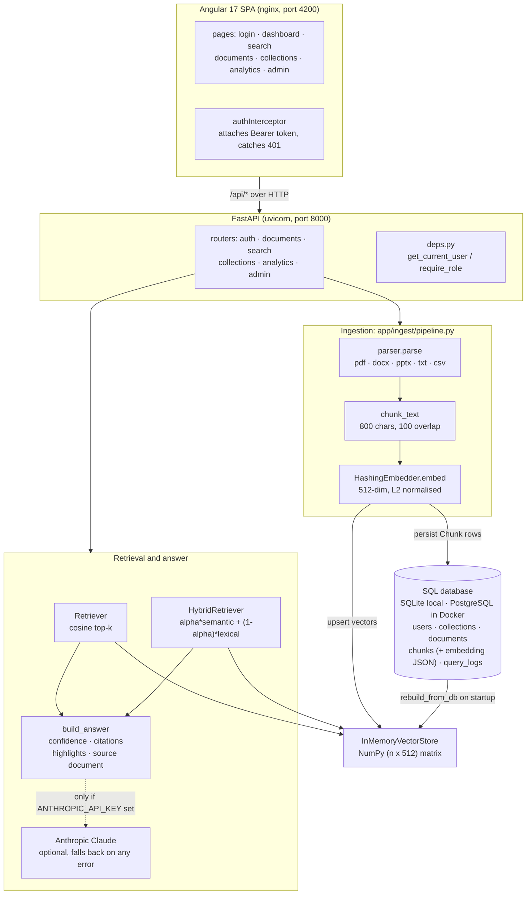

# Enterprise RAG Knowledge Assistant

| | |
|---|---|
| **What it is** | An internal knowledge system: upload documents, ask questions, get answers whose every clause is a verbatim quote from a numbered source |
| **Stack** | FastAPI · SQLAlchemy · Alembic · NumPy · PostgreSQL (SQLite locally) · Angular |
| **Run it** | `docker compose up --build`, or see [Installation](#installation) |
| **Tests** | 107 backend (pytest) · 20 frontend (Karma/Jasmine) · migrations verified against PostgreSQL in CI |
| **Read first** | [Architecture](#architecture), then [Design decisions](#design-decisions--trade-offs) |

**The three things worth looking at:** every RAG layer is written out rather than imported, so the embedder, the vector store and the retrievers are all readable code; the answer is extractive by construction, which makes the citation contract testable (a test asserts each quote is a literal substring of the chunk its marker points at); and citations have relevance floors, so a chunk that shares no vocabulary with the question is not quoted merely for ranking third.

An internal company knowledge system built as a full Retrieval Augmented Generation pipeline: upload
documents in five formats, have them parsed, chunked, embedded and indexed, then ask questions in plain
language and get back an answer whose every clause is a verbatim quote from a numbered source. It exists
because "build a RAG app" usually means gluing a hosted embedding API to a hosted vector DB and a hosted
LLM, which teaches you the vendor's SDK rather than the retrieval system. Here every layer is written out
and runs offline by default: the embedder is a hashing bag-of-words model in NumPy, the vector store is a
cosine-similarity matrix in process memory, and the answer generator is deterministic and extractive, so
nothing is a black box and the whole thing is testable without a network. The Anthropic Claude path exists
but sits behind an environment variable and is never required. This is a learning and portfolio project,
not a production system.

## Concepts demonstrated

- **The full RAG pipeline written by hand**: parse, chunk with overlap, embed, index, retrieve, ground,
  cite. No LangChain, no LlamaIndex, no hosted vector database.
- **Multi-format document ingestion**: PDF, DOCX, PPTX, TXT and CSV, each with its own parser and each
  covered by a test that builds a genuine byte-valid file of that type.
- **Embeddings from first principles**: the hashing trick, L2 normalisation, and why cosine similarity of
  unit vectors is a single dot product.
- **Why stopword removal matters**: `app/ingest/embed.py` records a measured case where an off-topic
  question scored 0.228 against a chunk while the on-topic question scored 0.254, and what removing
  function words did to that separation.
- **Hybrid retrieval and score fusion**: min-max normalising two incompatible score scales before blending
  them with a weight, and why the raw cosine is still reported separately from the fused rank.
- **Citation integrity as a testable contract**: the extractive generator only quotes, so a test can assert
  that every clause in the answer is a literal substring of the chunk its marker points at.
- **Offset discipline**: every `start`/`end` pair in an API response indexes into a string that response
  also carries, so the client never has to re-derive match positions.
- **Confidence scoring that is honest about being a heuristic**: three measured signals (term coverage,
  length-corrected relevance, corroboration) blended with hand-picked weights, documented as such.
- **Index and database consistency**: a vector index that lives in RAM must be rebuildable from durable
  storage, which is why chunk embeddings are persisted as JSON and replayed on startup.
- **JWT authentication with two roles**, dependency-injected route guards, and the 401 versus 403 distinction.
- **Angular 17 standalone components** with signals, functional route guards, a functional HTTP interceptor,
  and lazily loaded routes.
- **Container orchestration**: one `docker compose up --build` brings up Postgres, the API, and an
  nginx-served SPA that proxies `/api` to the backend.

## Architecture


```mermaid
flowchart TB
    subgraph FE["Angular 17 SPA (nginx, port 4200)"]
        PAGES["pages: login · dashboard · search<br/>documents · collections · analytics · admin"]
        INT["authInterceptor<br/>attaches Bearer token, catches 401"]
    end

    FE -->|"/api/* over HTTP"| API

    subgraph API["FastAPI (uvicorn, port 8000)"]
        ROUTERS["routers: auth · documents · search<br/>collections · analytics · admin"]
        DEPS["deps.py<br/>get_current_user / require_role"]
    end

    ROUTERS --> PIPE
    ROUTERS --> RET

    subgraph PIPE["Ingestion: app/ingest/pipeline.py"]
        P1["parser.parse<br/>pdf · docx · pptx · txt · csv"] --> P2["chunk_text<br/>800 chars, 100 overlap"]
        P2 --> P3["HashingEmbedder.embed<br/>512-dim, L2 normalised"]
    end

    subgraph RET["Retrieval and answer"]
        T1["Retriever<br/>cosine top-k"] --> T3
        T2["HybridRetriever<br/>alpha*semantic + (1-alpha)*lexical"] --> T3
        T3["build_answer<br/>confidence · citations<br/>highlights · source document"]
        T3 -.->|"only if ANTHROPIC_API_KEY set"| CLAUDE["Anthropic Claude<br/>optional, falls back on any error"]
    end

    P3 -->|"persist Chunk rows"| DB
    P3 -->|"upsert vectors"| VS
    T1 --> VS
    T2 --> VS

    DB[("SQL database<br/>SQLite local · PostgreSQL in Docker<br/>users · collections · documents<br/>chunks (+ embedding JSON) · query_logs")]
    VS["InMemoryVectorStore<br/>NumPy (n x 512) matrix"]

    DB -->|"rebuild_from_db on startup"| VS
```

The single load-bearing idea in that diagram is the arrow from the database back into the vector store.
Vectors live in process memory, so a restart would otherwise leave every previously uploaded document listed
in the UI but invisible to search. Persisting `chunks.embedding` as JSON and replaying it in the FastAPI
lifespan handler is what makes a restart safe.

## Tech stack

| Component | Technology | Why this choice |
| --- | --- | --- |
| API framework | `fastapi` | Type hints become request validation and OpenAPI docs for free, and its dependency-injection system is what makes `get_current_user` / `require_role("admin")` a one-line route guard. |
| ASGI server | `uvicorn[standard]` | The reference ASGI server for FastAPI; the `standard` extra pulls in the fast HTTP and websocket parsers. |
| File uploads | `python-multipart` | FastAPI's `UploadFile` needs it to parse `multipart/form-data`; without it the upload endpoint cannot exist. |
| Vector math | `numpy` | The whole retrieval layer is one `(n, dim) @ (dim,)` matrix-vector product. NumPy makes that a single line with no vector-database server. |
| PDF parsing | `pypdf` | Pure Python, no system libraries to install, and its page-by-page API maps directly onto the page numbers that end up in citations. |
| DOCX parsing | `python-docx` | Reads paragraphs and table cells separately, so table content is not silently dropped. |
| PPTX parsing | `python-pptx` | Exposes shapes, text frames and tables per slide, which is what lets each slide become its own citable page. |
| ORM | `sqlalchemy` | The 2.0 `Mapped[...]` declarative style is typed, and one model set runs unchanged on SQLite locally and PostgreSQL in Docker. |
| PostgreSQL driver | `psycopg2-binary` | Needed only for the Docker and hosting path; SQLite needs no driver, which keeps local setup at zero installs. |
| JWT | `python-jose[cryptography]` | Signs and verifies HS256 access tokens; the `cryptography` extra provides the vetted backend. |
| Password hashing | `bcrypt` | Deliberately slow and salted. Used directly rather than through `passlib` so the 72-byte truncation is explicit in `app/core/security.py`. |
| Schemas | `pydantic` | Every request and response body is a declared model, so the API contract and the docs cannot drift from the code. |
| Settings | `pydantic-settings` | Loads config from environment variables or `.env` with typed defaults, which is how the offline-first defaults are expressed. |
| Email validation | `email-validator` | Backs Pydantic's `EmailStr` on the auth schemas. |
| Tests | `pytest` | Fixtures make "fresh database plus empty index plus a logged-in user" a single decorator. |
| Test transport | `httpx` | The transport FastAPI's `TestClient` runs on, so the API tests exercise real HTTP semantics in-process. |
| Frontend framework | `@angular/core` 17 | Standalone components remove NgModule boilerplate, and signals give fine-grained reactivity without a state-management library. |
| Routing | `@angular/router` | `loadComponent` lazy routes plus functional `CanActivateFn` guards (`authGuard`, `adminGuard`). |
| HTTP client | `@angular/common` (`provideHttpClient`) | Functional interceptors let auth be a single pure function rather than an injectable class. |
| Forms | `@angular/forms` | Template-driven `ngModel` bindings are enough for the small forms here; no reactive-forms ceremony needed. |
| Reactive streams | `rxjs` | Angular's `HttpClient` returns observables; used for request composition inside the services. |
| Change detection | `zone.js` | Angular 17's default change-detection mechanism, listed as the polyfill in `angular.json`. |
| Safe HTML | `@angular/platform-browser` (`DomSanitizer`) | The search page escapes text itself and then injects `<mark>` tags, so it needs an explicit trust boundary rather than an implicit one. |
| Language | `typescript` 5.2 | `strict` plus `strictTemplates` in `tsconfig.json`, so template type errors fail the build. |
| Optional LLM | `anthropic` (commented in `requirements.txt`) | Enables generated rather than extractive answers. Left out of the default install on purpose so the repo installs and tests with no API key. |

## Folder structure

```
enterprise-rag-knowledge-assistant/
├── backend/
│   ├── app/
│   │   ├── main.py               FastAPI app: routers, CORS, lifespan, /health
│   │   ├── deps.py               get_current_user + require_role dependencies
│   │   ├── api/routes/           one router module per feature area
│   │   │   ├── auth.py           register / login / me / logout
│   │   │   ├── documents.py      list / upload / get / delete documents
│   │   │   ├── search.py         cited answers + raw semantic and hybrid search
│   │   │   ├── collections.py    CRUD for document groupings
│   │   │   ├── analytics.py      dashboard counts and usage stats
│   │   │   └── admin.py          users, permissions, versioning, index rebuild
│   │   ├── core/
│   │   │   ├── config.py         pydantic-settings Settings with offline defaults
│   │   │   └── security.py       bcrypt hashing + JWT encode/decode
│   │   ├── db/session.py         SQLAlchemy engine, SessionLocal, init_db, get_db
│   │   ├── models/               ORM tables
│   │   │   ├── base.py           DeclarativeBase + utcnow()
│   │   │   ├── user.py           User + Role enum
│   │   │   └── document.py       Collection, Document, Chunk, QueryLog
│   │   ├── schemas/              Pydantic request/response contracts
│   │   │   ├── user.py           UserCreate, UserOut, Token, PermissionUpdate
│   │   │   ├── document.py       DocumentOut/List, Collection{Create,Out,Detail}
│   │   │   └── search.py         SearchRequest, SearchResults, AnswerResponse
│   │   ├── ingest/               upload to index
│   │   │   ├── parser.py         five format parsers + extension router
│   │   │   ├── chunk.py          overlapping windows with page and span metadata
│   │   │   ├── embed.py          HashingEmbedder, tokenizer, stopwords
│   │   │   └── pipeline.py       ingest_document / reingest_document
│   │   ├── store/vector_store.py InMemoryVectorStore + get_store() singleton
│   │   ├── retrieve/
│   │   │   ├── retriever.py      semantic (cosine) retrieval
│   │   │   └── hybrid.py         lexical + semantic score fusion
│   │   └── generate/
│   │       ├── llm.py            extractive generator + optional Claude path
│   │       └── answer.py         confidence, citations, highlights, source doc
│   ├── tests/                    85 pytest tests (see Testing)
│   │   ├── conftest.py           offline env setup, client/auth/admin fixtures
│   │   ├── fixtures.py           generators for real PDF/DOCX/PPTX/TXT/CSV bytes
│   │   ├── test_parsers.py       per-format parsing and ingestion
│   │   ├── test_pipeline.py      chunking, embedding, retrieval, answers
│   │   ├── test_index.py         vector store internals and rebuild behaviour
│   │   └── test_api.py           HTTP-level flows, auth, versioning, analytics
│   ├── requirements.txt          backend dependencies
│   ├── pytest.ini                testpaths, pythonpath, quiet output
│   ├── Dockerfile                python:3.11-slim image running uvicorn
│   └── .env.example              every setting with its offline-first default
├── frontend/
│   ├── src/
│   │   ├── main.ts               bootstrapApplication entrypoint
│   │   ├── index.html            SPA shell
│   │   ├── styles.scss           design tokens and shared component classes
│   │   └── app/
│   │       ├── app.component.*   nav shell, role-aware menu, logout
│   │       ├── app.config.ts     router + HttpClient providers
│   │       ├── app.routes.ts     lazy routes with auth/admin guards
│   │       ├── models.ts         TypeScript mirrors of the FastAPI schemas
│   │       ├── guards/           authGuard, adminGuard
│   │       ├── interceptors/     authInterceptor (Bearer token, 401 handling)
│   │       ├── services/         one typed HTTP client per feature area
│   │       └── pages/            login, dashboard, search, documents,
│   │                             collections, analytics, admin
│   ├── angular.json              build config, outputPath dist/frontend
│   ├── nginx.conf                serves the SPA, proxies /api to the backend
│   └── Dockerfile                node build stage then nginx serve stage
├── .github/workflows/ci.yml      pytest on 3.12 + ng build on Node 20
├── docker-compose.yml            db + backend + frontend
├── MEMORY.md                     the original working spec for the repo
└── LICENSE                       MIT
```

## Codebase walkthrough

This is the section to read if you want to understand the system without opening the source. It follows the
data in the order it actually moves.

### Configuration and application startup

`backend/app/core/config.py` defines a single `Settings` class built on `pydantic-settings`. Field names map
case-insensitively onto environment variables, so `DATABASE_URL` fills `database_url`. Every default is
chosen so the service runs with nothing installed: `database_url` defaults to `sqlite:///./rag.db`,
`embedding_dim` to 512, `hybrid_alpha` to 0.6, `default_top_k` to 5, `max_context_chars` to 4000, and
`first_admin_email` / `first_admin_password` to a seeded bootstrap admin. `get_settings()` is
`lru_cache`-wrapped, and a module-level `settings` instance is exported for the modules that import it
directly. The `cors_origins_list` property splits the comma-separated origin string.

`backend/app/db/session.py` builds the SQLAlchemy `engine` from `settings.database_url`. It adds
`check_same_thread=False` only for SQLite URLs, because FastAPI runs sync endpoints on a threadpool and
SQLite objects are otherwise thread-bound, while Postgres neither needs nor accepts the argument. It exposes
`SessionLocal`, `init_db()` (which imports the model modules for their table-registration side effect and
then calls `Base.metadata.create_all`) and `get_db()`, the generator dependency every route uses.

`backend/app/main.py` is the composition root. Its `lifespan` async context manager runs three things before
the app serves traffic: `init_db()`, `_seed_admin()` (which creates the bootstrap admin only if both settings
are present and the email is not already taken), and `get_store().rebuild_from_db(db)`, which reloads the
vector index from persisted chunk rows and logs how many vectors were restored. Six routers are mounted under
`/api/auth`, `/api/documents`, `/api/search`, `/api/collections`, `/api/analytics` and `/api/admin`, CORS is
configured from `settings.cors_origins_list`, and an unauthenticated `GET /health` returns the service name,
version and `get_store().stats()`. Exposing the live index size on the health check is the cheapest way to
confirm from outside the process that the startup rebuild actually ran.

### Data model

`backend/app/models/base.py` holds the SQLAlchemy 2.0 `Base(DeclarativeBase)` and `utcnow()`, the single
timestamp default used by every table so all rows are timezone-aware UTC.

`backend/app/models/user.py` defines `Role` (a `str` enum with `ADMIN` and `USER`, so it serialises straight
to JSON) and `User` with `id`, unique indexed `email`, `hashed_password`, `role`, `is_active` and
`created_at`. The role is a plain string column rather than a separate roles table, which is the smallest
design that supports the two-role scheme the app actually needs.

`backend/app/models/document.py` holds the four remaining tables:

- `Collection` groups documents. Its `documents` relationship cascades `all, delete-orphan`, so deleting a
  collection deletes its documents and, transitively, their chunks.
- `Document` is one uploaded file: `filename`, `content_type`, `format` (the lowercased extension used to
  route to a parser), `collection_id`, `owner_id`, `version`, `status` (`processing` / `ready` / `failed`),
  `num_chunks`, and an `error` string.
- `Chunk` is a retrievable span: `document_id`, `collection_id` (denormalised so the vector store can filter
  by collection without a join), `chunk_index`, `page`, `char_start`, `char_end`, `text`, and `embedding`
  stored in a `JSON` column as a list of floats. That JSON column is what makes the in-memory index
  rebuildable.
- `QueryLog` records `user_id`, `collection_id`, `question`, `confidence` and `cited_document_ids` (a JSON
  list). The last field exists because "most referenced documents" computed from chunk counts measures
  document size, not usage.

### Ingestion: `backend/app/ingest/`

**`parser.py`** turns raw bytes into plain text. `parse(filename, data)` routes on the file extension through
the `PARSERS` dict to one of `parse_pdf`, `parse_docx`, `parse_pptx`, `parse_txt` or `parse_csv`, and raises
`ValueError` naming `SUPPORTED_FORMATS` for anything else. The third-party imports sit inside the functions,
so the TXT/CSV path and most of the test suite need nothing extra loaded. `parse_pdf` and `parse_pptx` join
pages and slides with `PAGE_BREAK` (`\f`), which is the mechanism that carries page numbers all the way to
the citation. `parse_docx` reads paragraphs and table cells. `parse_pptx` falls back from joining a
paragraph's runs to `paragraph.text`, because some authoring tools put text directly on the paragraph and the
run-join would otherwise yield a blank slide. `parse_csv` flattens each row into `column: value; column:
value` lines, which reads far better to a bag-of-words embedder than raw comma-delimited text, and falls back
to the raw text when there is no usable body.

**`chunk.py`** exposes `chunk_text(text, chunk_size=800, overlap=100)`. It splits on `PAGE_BREAK` first so
each chunk knows its 1-based page, then slides a window forward by `chunk_size - overlap` characters so
neighbouring chunks share context and a fact straddling a boundary survives whole in at least one of them.
Each returned dict carries `text`, `page`, a document-global `chunk_index`, `char_start` and `char_end`. The
offsets are re-derived after stripping whitespace so that `page_text[char_start:char_end] == text` exactly,
which the highlighting layer downstream depends on.

**`embed.py`** is the default embedder. `tokenize` finds lowercase alphanumeric runs; `content_tokens` drops a
hand-written `STOPWORDS` set but falls back to the raw tokens when a string is entirely stopwords, because an
all-zero vector would score zero against everything and give the caller no ranking at all. `HashingEmbedder`
hashes each content token with MD5 into one of `dim` buckets (MD5 rather than the built-in `hash()` because
Python salts the latter per process, which would make embeddings irreproducible across restarts), accumulates
counts, and L2-normalises. `embed_one` returns one vector, `embed` stacks a batch, `get_embedder()` returns
the process-wide singleton, and `embed_texts` returns JSON-serialisable lists. The module docstring records
the measurement that motivated stopword removal.

**`pipeline.py`** is what the upload endpoint calls. `ingest_document(db, filename=, data=, ...)` creates the
`Document` row immediately with status `processing` and flushes to get its id, then hands off to the private
`_index_content`. That function parses and chunks inside a `try`, flipping the document to `failed` with a
truncated error message if the format is unsupported or the file is corrupt. A parse that succeeds but yields
nothing is treated separately: status `ready`, zero chunks, and `error` set to `EMPTY_TEXT_NOTE`, so a scanned
image-only PDF explains itself instead of silently never appearing in search. On the happy path it embeds all
chunk texts in one batch, writes a `Chunk` row per chunk (flushing each to get its id for the vector record),
commits, and only then calls `get_store().upsert(...)`. Indexing after the commit is deliberate: the store
must mirror durable state, never anticipate it. `reingest_document` implements versioning by deleting the old
chunks from both the database and the vector index, bumping `version`, and re-running `_index_content` under
the same document id, so existing collection membership and citations still resolve while stale text stops
surfacing.

### Vector store: `backend/app/store/vector_store.py`

`InMemoryVectorStore` keeps one `(n, dim)` NumPy float32 matrix `_vectors`, a parallel `_meta` list where
index *i* describes row *i*, and `_row_by_chunk`, a `chunk_id -> row index` map.

`upsert(records)` is a genuine upsert, not an append: a record whose `chunk_id` is already known replaces its
row rather than adding a second one, which is what stops re-ingestion and repeated rebuilds from
double-counting a source in the citation list. It handles the awkward case of the same `chunk_id` appearing
twice within one batch by patching the staged vector in `new_rows` instead of writing past the end of the
matrix, and it computes the row index a new record will occupy as `len(self._meta)`, not
`len(self._meta) + len(new_rows)`, which would skew every record after the first in a batch.

`candidate_rows(filters)` returns the row indices matching every non-`None` filter among `FILTERABLE`
(`collection_id`, `document_id`, `format`). `search(query_vector, top_k, ...)` computes `self._vectors @ query`
in one matrix-vector product; because every stored vector is unit norm, that dot product is the cosine
similarity. It filters, sorts on `(-score, chunk_id)` so ties break identically on every process, and attaches
`score` to a copy of each metadata dict. `score_all` returns the full score array for hybrid search, which
needs the whole distribution rather than just the top-k. `delete_document` filters out the affected rows and
calls `_reindex()`, because row indices shift and a stale `_row_by_chunk` would make the next upsert overwrite
the wrong row.

`rebuild_from_db(db)` is the durability story. It clears the index, reads every `Chunk` joined to its
`Document` ordered by `chunk.id` (so the post-restart layout matches the layout built incrementally during
ingest and ties break the same way), and re-upserts. Embeddings whose stored width no longer matches the
configured `dim` are re-embedded from the chunk text and written back rather than raising, which is what
happens if someone changes `EMBEDDING_DIM` between runs. `stats()` reports vector count, dimension and
distinct document count, and `get_store()` returns the process-wide singleton.

### Retrieval: `backend/app/retrieve/`

**`retriever.py`** contains `Retriever`, which embeds the query with the same embedder used at ingest time
(query and document vectors only share a space if the same function produced them) and delegates to
`store.search` with the top-k and metadata filters. That is the whole semantic path.

**`hybrid.py`** contains `HybridRetriever`. It scores every stored chunk semantically via `store.score_all`,
narrows to `store.candidate_rows(...)` so filter semantics cannot diverge between the two modes, computes a
lexical score per candidate, min-max normalises both score arrays over the candidate set, and fuses them as
`alpha * semantic + (1 - alpha) * lexical`. `_lexical_score` is the overlap coefficient, the fraction of the
question's content tokens present in the chunk, with stopwords excluded on both sides for the same reason
they are excluded from the embedding. Results are sorted on `(-fused, chunk_id)` for stability, and each
result carries three numbers: `score` stays the raw cosine so it means the same thing in both modes and is
comparable across queries, while `lexical_score` and `hybrid_score` are exposed separately because the fused
value is a within-result-set rank whose top is always about 1.0 and would mislead if presented as a
similarity.

### Answer assembly: `backend/app/generate/`

**`llm.py`** is the generator. `sentence_spans(text)` splits on end punctuation followed by whitespace or a
newline (the newline arm matters because CSV and DOCX text arrives as unpunctuated lines that would otherwise
collapse into one enormous sentence) and returns offsets rather than strings, so a quote can be mapped back
to its exact position in the chunk. `select_support(question, chunks, max_chunks=3)` picks, from each of the
top three chunks, the sentence containing the most question content words, with a small length penalty so a
short precise sentence beats a long rambling one; over-long sentences are cut at a word boundary by
`_truncate_span`, and a prefix of a sentence is still an exact substring, so the quoting contract survives
truncation. `extractive_answer` stitches the selected sentences into
`"Based on the most relevant sources: <quote> [1] <quote> [2] ..."`. `cited_markers(answer)` parses the `[n]`
markers back out. `generate(question, context, chunks=, support=)` returns the extractive answer whenever
`ANTHROPIC_API_KEY` is absent, and otherwise builds a grounded prompt via `build_prompt` and calls
`anthropic.Anthropic().messages.create` with `CLAUDE_MODEL`, falling back to the extractive answer on any
exception (missing SDK, network, auth) so the pipeline never hard-fails. `LLMClient` is a thin injectable
wrapper around the same function.

**`answer.py`** assembles the payload the UI renders. `build_answer(query, retrieved)` calls
`llm.select_support` exactly once and passes the result to both the answer text and the citation builder, so
the quoted sentence and the highlighted span can never drift apart. `_assemble_context` concatenates chunks
into a `[n]`-marked context within `settings.max_context_chars`. `_confidence` blends three measured signals:
`coverage` (fraction of question content words present in the top chunk), `relevance` (cosine divided by
`sqrt(n / N)`, the best a chunk of that many distinct tokens could score, which removes the length bias that
would otherwise make every answer look low-confidence), and `support` (fraction of the other retrieved chunks
that also cover at least half the question), weighted 0.5 / 0.4 / 0.1. The docstring states plainly that the
weights are a judgement call and the number is a ranked heuristic, not a probability. `_find_term_spans`
locates query terms with a word-boundary-anchored regex, longest alternative first, then drops overlaps, so
"cat" is never highlighted inside "category". `_snippet_window` cuts the 240-character display snippet centred
on the supporting span rather than taking a naive prefix, because an 800-character chunk truncated at 240
regularly cuts away the exact sentence the answer quoted, and it returns a `shift` that converts chunk offsets
into snippet offsets. `_build_citations` emits one entry per retrieved chunk with `marker`, source metadata,
`snippet`, a `used` flag derived from parsing markers out of the answer text, per-snippet `highlights`, and a
`supporting_span` that is `None` for chunks that were retrieved but not quoted. The invariant the whole module
is built around is stated in its docstring: every `start`/`end` pair indexes into a string that is also in the
payload, because an offset into a string the client never receives cannot be rendered or checked.

### API layer: `backend/app/api/routes/` and `backend/app/deps.py`

`deps.py` holds `oauth2_scheme` (an `OAuth2PasswordBearer` with `auto_error=False`), `get_current_user`, which
decodes the bearer token, rejects anything whose `type` claim is not `access`, loads the user and rejects
inactive accounts, and `require_role(role)`, a dependency factory returning a guard that adds a role check on
top. The module documents the split it enforces: 401 means we do not know who you are, 403 means we do and you
are not allowed.

`auth.py` exposes `register` (409 on a duplicate email, always role `user`), `login` (takes an
`OAuth2PasswordRequestForm` so Swagger's Authorize button and standard OAuth2 clients work unchanged, with
`username` carrying the email; 401 on bad credentials, 403 on a disabled account), `me`, and a `logout` that
is honest about being a no-op for stateless JWTs.

`documents.py` exposes `list_documents` (optional `collection_id` and `format` filters, ordered by
`created_at DESC, id DESC` because batch uploads can share a timestamp and would otherwise page unstably),
`upload_document` (validates the extension against `SUPPORTED_FORMATS` and the collection's existence before
reading the file, rejects empty uploads, then runs `ingest_document` synchronously and returns the finished
document), `get_document`, and `delete_document`, which enforces owner-or-admin, deletes the row (cascading to
chunks) and then drops the document's vectors from the index.

`search.py` has a private `_retrieve(payload)` that picks `HybridRetriever` or `Retriever` from
`payload.mode`. `POST /query` retrieves, calls `build_answer`, then writes a `QueryLog` recording only the
document ids whose citations came back with `used: true`, so the analytics panel reflects usage rather than
corpus size. `POST /semantic` and `POST /hybrid` force the mode and return the raw ranked chunks for callers
that want to build their own presentation.

`collections.py` is CRUD plus a `_to_out` helper that attaches a live `document_count`. `get_collection`
returns the collection with its documents; `delete_collection` enforces owner-or-admin, collects the affected
document ids before the delete, then removes each one's vectors from the index after the commit.

`analytics.py` has `overview`, returning document, collection, chunk, user, query and ready-document counts
plus `indexed_vectors` from the live store (comparing `chunks` against `indexed_vectors` is the quickest way
to spot index drift), and `usage`, returning the ten most recent questions with their confidences, the five
documents with the most chunks, and the five most-cited documents. The citation tally is computed in Python
rather than SQL, with a comment explaining why: the ids live in a JSON column and JSON aggregation is not
portable between SQLite and PostgreSQL, both of which this app has to run on.

`admin.py` is every route behind `require_role("admin")`: `list_users`; `set_permissions`, which validates the
role against `_VALID_ROLES` and can also flip `is_active`; `create_version`, which bumps the counter alone
when called with no file and performs a full content replacement via `reingest_document` when a file is
supplied; `rebuild_index`, the same `rebuild_from_db` call startup makes, exposed so an operator can repair
drift without a restart; and `admin_delete_document`, a hard delete that ignores ownership.

`backend/app/schemas/` mirrors all of this in Pydantic. `search.py` is the notable one: `SearchRequest`
constrains `top_k` to 1..50, `format` to a regex over the five supported extensions, and `mode` to
`semantic|hybrid`, so an invalid filter is a 422 from the framework rather than a silent empty result set.
`AnswerResponse`, `Citation`, `Highlight` and `Span` encode the offset invariant described above.

### Frontend: `frontend/src/app/`

`main.ts` bootstraps `AppComponent` with `appConfig`, which provides the router (with
`withComponentInputBinding()`) and `HttpClient` wired with `authInterceptor`.

`app.routes.ts` declares lazy `loadComponent` routes for login, dashboard, documents, search, collections,
analytics and admin. Everything except login sits behind `authGuard`; `/admin` additionally requires
`adminGuard`. Unknown paths redirect to the dashboard.

`guards/auth.guard.ts` is two functional `CanActivateFn`s: `authGuard` checks for a stored token and otherwise
returns a `UrlTree` to `/login`; `adminGuard` checks `auth.isAdmin()` and otherwise redirects to the dashboard.

`interceptors/auth.interceptor.ts` clones each outgoing request with an `Authorization: Bearer` header when a
token exists, and on a 401 from anything other than the login call itself clears the session and navigates to
`/login`.

`services/` is one typed client per feature area, all built on `ApiService`, whose only member is
`baseUrl = '/api'`; a relative base works both behind nginx in Docker and behind Firebase Hosting rewrites.
`AuthService` holds the session: a private `signal<User | null>` exposed read-only as `user`, with
`isAuthenticated` and `isAdmin` as `computed` signals, the token in `localStorage` under `rag_token`, a
`login()` that posts a URL-encoded OAuth2 form and then chains `loadProfile()`, plus `register()`, `restore()`
(called from `AppComponent.ngOnInit`, logging out if the stored token no longer resolves) and `logout()`.
`DocumentService` wraps list, upload (building the `FormData`) and delete; `SearchService` wraps `ask()` and
`search(mode)`; `CollectionService` and `AdminService` wrap their endpoints; `AnalyticsService` wraps
`overview()` and `usage()`.

`models.ts` is a hand-written TypeScript mirror of the FastAPI response schemas, down to the comments
explaining that `Highlight` offsets are relative to `answer` and `Citation.highlights` offsets are relative to
`snippet`.

`pages/` holds seven standalone components, each with its own template and stylesheet. `LoginComponent` toggles
between login and register with a `signal<'login' | 'register'>`. `DashboardComponent` loads both analytics
endpoints and derives a `tiles` getter for the summary cards. `SearchComponent` owns the question form (mode
and collection selectors), calls `SearchService.ask`, maps confidence to `High` / `Medium` / `Low` bands at
0.6 and 0.3, and has a `highlight()` method that HTML-escapes text before wrapping matched terms in `<mark>`
and passing the result through `DomSanitizer`. That method has a defect described under
[Limitations](#limitations--future-improvements). `DocumentsComponent` supports drag-and-drop and multi-file
upload with an `accept` list of `.pdf,.docx,.pptx,.txt,.csv`, maps ingestion status to badge classes, and
confirms before deleting. `CollectionsComponent`, `AnalyticsComponent` (which computes bar widths from the
largest chunk count) and `AdminComponent` (role and activation toggles) round it out. `app.component.html`
renders the role-aware nav shell, hiding the Admin entry for non-admins.

`styles.scss` defines the design tokens (brand, surfaces, text, state colours, radii, shadows) and the shared
`card`, `btn`, `badge` and `empty-state` classes the pages compose.

### Infrastructure

`docker-compose.yml` defines three services: `db` (postgres:16 with a healthcheck and a named volume),
`backend` (built from `backend/Dockerfile`, pointed at Postgres via `DATABASE_URL`, waiting on the db
healthcheck), and `frontend` (built from `frontend/Dockerfile`, published on 4200). No vector-database service
appears, because the index is in-process and rebuilt from Postgres on startup. `frontend/Dockerfile` is a
two-stage build: Node 20 runs `npm run build`, then nginx serves `dist/frontend/browser` with `nginx.conf`,
which proxies `/api/` to `http://backend:8000/api/` and falls back to `index.html` for client-side routes.
`.github/workflows/ci.yml` runs pytest on Python 3.12 and `ng build` on Node 20 for pushes and pull requests
to `main`.

## Installation

Requires Python 3.11 or newer and, for the frontend, Node 20. Nothing else: no Postgres, no vector database,
no API key.

### Backend

```bash
git clone https://github.com/ranjan-del/enterprise-rag-knowledge-assistant.git
cd enterprise-rag-knowledge-assistant/backend

python3 -m venv .venv
source .venv/bin/activate          # Windows: .venv\Scripts\activate
pip install -r requirements.txt

cp .env.example .env               # optional; every value has a working default
uvicorn app.main:app --reload --port 8000
```

The API is then on `http://127.0.0.1:8000`, with interactive docs at `http://127.0.0.1:8000/docs`. Tables are
created on startup and a bootstrap admin (`admin@example.com` / `adminpass123` by default) is seeded. Change
`JWT_SECRET` and the admin credentials before exposing this anywhere.

### Frontend

```bash
cd enterprise-rag-knowledge-assistant/frontend
npm install
npm start                          # ng serve on http://localhost:4200
```

### Everything at once

```bash
docker compose up --build
```

This brings up PostgreSQL, the API on `http://localhost:8000` and the SPA on `http://localhost:4200` with
`/api` proxied to the backend. The frontend image build is subject to the same compile error noted above.

## Usage

Everything below is real output captured from a local run of `uvicorn app.main:app --port 8347` against a
fresh SQLite database, with two files uploaded: a short `leave-policy.txt` and a four-row `expenses.csv`.
Ids and timestamps are exactly as returned.

### 1. Check that the service is up

```bash
curl -s http://127.0.0.1:8347/health
```

```json
{
    "status": "ok",
    "service": "enterprise-rag-knowledge-assistant",
    "version": "1.0.0",
    "index": {
        "vectors": 0,
        "dim": 512,
        "documents": 0
    }
}
```

### 2. Log in as the seeded admin

```bash
curl -s -X POST http://127.0.0.1:8347/api/auth/login \
  -d "username=admin@example.com&password=adminpass123"
```

```json
{
  "access_token": "eyJhbGciOiJIUzI1NiIsInR5...",
  "token_type": "bearer"
}
```

```bash
TOK=<paste the access_token>
```

### 3. Create a collection

```bash
curl -s -X POST http://127.0.0.1:8347/api/collections \
  -H "Authorization: Bearer $TOK" -H "Content-Type: application/json" \
  -d '{"name":"HR Policies","description":"Employee handbook and leave policy"}'
```

```json
{
    "id": 1,
    "name": "HR Policies",
    "description": "Employee handbook and leave policy",
    "owner_id": 1,
    "created_at": "2026-08-02T18:18:46.106461",
    "document_count": 0
}
```

### 4. Upload documents

```bash
curl -s -X POST http://127.0.0.1:8347/api/documents/upload \
  -H "Authorization: Bearer $TOK" \
  -F "file=@leave-policy.txt" -F "collection_id=1"
```

```json
{
    "id": 1,
    "filename": "leave-policy.txt",
    "format": "txt",
    "content_type": "text/plain",
    "status": "ready",
    "collection_id": 1,
    "owner_id": 1,
    "version": 1,
    "num_chunks": 1,
    "error": "",
    "created_at": "2026-08-02T18:18:46.148489"
}
```

The upload is synchronous, so `status: "ready"` and `num_chunks` are accurate the moment the call returns.
A second upload of `expenses.csv` returned the same shape with `"id": 2` and `"format": "csv"`.

### 5. Ask a question and get a cited answer

```bash
curl -s -X POST http://127.0.0.1:8347/api/search/query \
  -H "Authorization: Bearer $TOK" -H "Content-Type: application/json" \
  -d '{"query":"How many vacation days do employees get?","top_k":3}'
```

Abridged below; the real `citations[0].highlights` array had eight entries and there was a second citation.

```json
{
    "question": "How many vacation days do employees get?",
    "answer": "Based on the most relevant sources: Full-time employees accrue 20 vacation days per calendar year. [1] category: Meals; limit_usd: 60; approval_required: no; notes: Per day limit while travelling [2]",
    "confidence": 0.6544,
    "citations": [
        {
            "marker": "[1]",
            "chunk_id": 1,
            "document_id": 1,
            "filename": "leave-policy.txt",
            "page": 1,
            "score": 0.2921,
            "snippet": "Leave Policy\n\nFull-time employees accrue 20 vacation days per calendar year. Vacation days accrue monthly and unused days may be carried over to the following year up to a maximum of 5 days.\n\nSick leave is granted separately at 10 days per ...",
            "used": true,
            "highlights": [
                { "term": "employees", "start": 24, "end": 33 },
                { "term": "vacation",  "start": 44, "end": 52 },
                { "term": "days",      "start": 53, "end": 57 }
            ],
            "supporting_span": {
                "text": "Full-time employees accrue 20 vacation days per calendar year.",
                "start": 14,
                "end": 76
            }
        }
    ],
    "highlights": [
        { "term": "employees", "start": 46, "end": 55 },
        { "term": "vacation",  "start": 66, "end": 74 },
        { "term": "days",      "start": 75, "end": 79 }
    ],
    "source_document": {
        "document_id": 1,
        "filename": "leave-policy.txt",
        "page": 1,
        "collection_id": 1
    }
}
```

Two things in that response are worth pointing at. First, `answer.slice(46, 55)` really is `"employees"`, and
`citations[0].snippet.slice(14, 76)` really is the supporting sentence, which is the offset invariant holding
in practice. Second, this run also shows the honest weakness of the default stack: citation `[2]` is an
expense-policy row about meal limits that scored 0.0 and has nothing to do with vacation days, yet it was
still quoted, because `select_support` takes a sentence from each of the top three chunks unconditionally and
there is no relevance floor. See [Limitations](#limitations--future-improvements).

### 6. Compare hybrid retrieval

```bash
curl -s -X POST http://127.0.0.1:8347/api/search/hybrid \
  -H "Authorization: Bearer $TOK" -H "Content-Type: application/json" \
  -d '{"query":"hotel limit per night","top_k":2}'
```

Abridged to the score fields:

```json
{
    "query": "hotel limit per night",
    "mode": "hybrid",
    "results": [
        {
            "chunk_id": 2,
            "filename": "expenses.csv",
            "format": "csv",
            "score": 0.402911514043808,
            "lexical_score": 1.0,
            "hybrid_score": 1.0
        },
        {
            "chunk_id": 1,
            "filename": "leave-policy.txt",
            "format": "txt",
            "score": 0.08164965361356735,
            "lexical_score": 0.25,
            "hybrid_score": 0.0
        }
    ]
}
```

`score` is the raw cosine, `lexical_score` the query-token overlap coefficient, and `hybrid_score` the
min-max fused rank within this result set. All three are returned so the ranking is inspectable rather than
opaque.

### 7. Dashboard analytics

```bash
curl -s http://127.0.0.1:8347/api/analytics/overview -H "Authorization: Bearer $TOK"
```

```json
{
    "documents": 2,
    "collections": 1,
    "chunks": 2,
    "users": 1,
    "queries": 1,
    "ready_documents": 2,
    "indexed_vectors": 2
}
```

`chunks` (from SQL) equals `indexed_vectors` (from memory), which is the signal that the index has not
drifted.

```bash
curl -s http://127.0.0.1:8347/api/analytics/usage -H "Authorization: Bearer $TOK"
```

```json
{
    "recent_queries": [
        {
            "question": "How many vacation days do employees get?",
            "confidence": 0.6544,
            "created_at": "2026-08-02T18:18:58.563845"
        }
    ],
    "top_documents": [
        { "document_id": 1, "filename": "leave-policy.txt", "chunks": 1 },
        { "document_id": 2, "filename": "expenses.csv", "chunks": 1 }
    ],
    "most_cited_documents": [
        { "document_id": 1, "filename": "leave-policy.txt", "citations": 1 },
        { "document_id": 2, "filename": "expenses.csv", "citations": 1 }
    ]
}
```

### 8. Filters, auth failures, and admin

Filtering the document list by format returns only the CSV:

```bash
curl -s "http://127.0.0.1:8347/api/documents?format=csv" -H "Authorization: Bearer $TOK"
```

```json
{
    "items": [
        {
            "id": 2,
            "filename": "expenses.csv",
            "format": "csv",
            "content_type": "application/octet-stream",
            "status": "ready",
            "collection_id": 1,
            "owner_id": 1,
            "version": 1,
            "num_chunks": 1,
            "error": "",
            "created_at": "2026-08-02T18:18:46.187293"
        }
    ],
    "total": 1
}
```

Dropping the token gives a 401:

```bash
curl -s -o /dev/null -w "%{http_code}\n" http://127.0.0.1:8347/api/documents
# 401
curl -s http://127.0.0.1:8347/api/documents
# {"detail": "Could not validate credentials"}
```

An admin can force an index rebuild without restarting:

```bash
curl -s -X POST http://127.0.0.1:8347/api/admin/index/rebuild -H "Authorization: Bearer $TOK"
# {"detail": "Vector index rebuilt.", "vectors": 2}
```

### 9. Restart safety

Stopping the process and starting it again against the same SQLite file, then hitting `/health`:

```json
{
    "status": "ok",
    "service": "enterprise-rag-knowledge-assistant",
    "version": "1.0.0",
    "index": {
        "vectors": 2,
        "dim": 512,
        "documents": 2
    }
}
```

The index came back from zero to two vectors with no re-upload, because `rebuild_from_db` replayed the
persisted `chunks.embedding` values during the lifespan startup hook.

## API reference

`Auth` is `none` for open endpoints, `user` for any authenticated account, and `admin` for the admin role.
All authenticated routes take `Authorization: Bearer <token>`.

| Endpoint | Method | Auth | Purpose |
| --- | --- | --- | --- |
| `/health` | GET | none | Liveness probe; returns service name, version and live index stats. |
| `/api/auth/register` | POST | none | Create an account (always role `user`); 409 if the email is taken. |
| `/api/auth/login` | POST | none | OAuth2 password form (`username` = email); returns a JWT access token. |
| `/api/auth/me` | GET | user | Return the authenticated user's profile. |
| `/api/auth/logout` | POST | user | No-op acknowledgement; the client discards its token. |
| `/api/documents` | GET | user | List documents, optionally filtered by `collection_id` and `format`. |
| `/api/documents/upload` | POST | user | Upload a PDF/DOCX/PPTX/TXT/CSV and run the full ingestion pipeline. |
| `/api/documents/{document_id}` | GET | user | Return one document's detail and ingestion status. |
| `/api/documents/{document_id}` | DELETE | user | Delete a document and its vectors; owner or admin only. |
| `/api/search/query` | POST | user | Ask a question; returns answer, confidence, citations, highlights and source document, and logs the query. |
| `/api/search/semantic` | POST | user | Raw cosine-ranked chunks for a query. |
| `/api/search/hybrid` | POST | user | Raw chunks ranked by fused lexical plus semantic score. |
| `/api/collections` | GET | user | List collections with their document counts. |
| `/api/collections` | POST | user | Create a collection owned by the caller. |
| `/api/collections/{collection_id}` | GET | user | Return a collection together with its documents. |
| `/api/collections/{collection_id}` | DELETE | user | Delete a collection and its documents; owner or admin only. |
| `/api/analytics/overview` | GET | user | Dashboard counts, including `indexed_vectors` from the live index. |
| `/api/analytics/usage` | GET | user | Recent questions, most-chunked documents, most-cited documents. |
| `/api/admin/users` | GET | admin | List all users. |
| `/api/admin/users/{user_id}/permissions` | PUT | admin | Change a user's role and/or active status. |
| `/api/admin/documents/{document_id}/versions` | POST | admin | Publish a new version; with a file it re-ingests, without one it only bumps the counter. |
| `/api/admin/index/rebuild` | POST | admin | Rebuild the in-memory index from persisted chunk rows. |
| `/api/admin/documents/{document_id}` | DELETE | admin | Hard-delete any document regardless of owner. |

Interactive OpenAPI docs are served at `/docs` (Swagger UI) and `/redoc` when the app is running.

## Testing

```bash
cd backend
source .venv/bin/activate
python -m pytest
```

`pytest.ini` sets `addopts = -q`, which suppresses the summary line. To see the counts:

```bash
python -m pytest --tb=no -rN
```

Five of the pipeline tests cover the citation relevance floors specifically, including the one that
matters most: a question nothing in the corpus answers must produce no citations at all rather than a
confident quote from whatever ranked third.

Observed result on this machine (Python 3.14.6, macOS):

```
107 passed, 1 warning in 31.55s
```

**107 tests pass.** The single warning is a Starlette deprecation notice about `httpx` inside `TestClient`, not
a test failure. Per file:

| File | Tests | Covers |
| --- | --- | --- |
| `tests/test_pipeline.py` | 28 | Chunking spans and overlap, embedder determinism and normalisation, stopword behaviour, semantic and hybrid ranking, answer text being lifted verbatim from the cited chunk, confidence separating answerable from unanswerable questions, highlight word boundaries, supporting spans, and the offline generation fallback. |
| `tests/test_api.py` | 27 | HTTP flows: auth, upload-to-answer, collection scoping, metadata filters, versioning, analytics, permissions, ownership checks, and the assertion that every offset in a query response indexes into a string that response carries. |
| `tests/test_index.py` | 15 | Vector store internals: upsert replacing rather than duplicating, batch row-lookup correctness, ANDed metadata filters, tie-break stability, and `rebuild_from_db` being idempotent, excluding deleted documents, and repairing wrong-width embeddings. |
| `tests/test_production_safety.py` | 13 | The rails that only fire when `ENVIRONMENT=production`: a placeholder or short `JWT_SECRET` refuses to boot, the shipped `admin@example.com` / `adminpass123` bootstrap admin is refused, and `create_all` is disabled so Alembic owns the schema. |
| `tests/test_migrations.py` | 3 | `alembic upgrade head` builds every table, `compare_metadata` finds no drift against the models, and `downgrade base` removes everything again. |
| `tests/test_parsers.py` | 15 | Every supported format parsed and ingested end to end, PDF page numbers reaching the citation, text-free files being flagged rather than silently empty, and corrupt files failing cleanly. |

The tests do not mock the file formats. `tests/fixtures.py` builds genuine DOCX and PPTX bytes with the same
libraries the parsers read them back with, and hand-assembles a standards-valid PDF with a correct
cross-reference table, because no PDF writer is in the dependency list and adding one purely for tests would
be a heavier commitment than forty lines of byte assembly.

`tests/conftest.py` sets `DATABASE_URL`, `JWT_SECRET` and the admin credentials, and pops `ANTHROPIC_API_KEY`,
before importing any application module, so the cached `Settings` and the SQLAlchemy engine bind to a
throwaway SQLite file and the offline answer path is forced. The `client` fixture drops and recreates all
tables and clears the vector store around every test.

Frontend unit tests (Karma + Jasmine, headless Chrome):

```console
$ cd frontend && npm test
Chrome Headless: Executed 20 of 20 SUCCESS
TOTAL: 20 SUCCESS
```

They cover `AuthService`, the interceptor and both route guards. Two specs are there for behaviour that is
easy to get subtly wrong: login must be sent as an OAuth2 password *form* rather than JSON, since a JSON body
comes back as a 422 that looks exactly like a rejected password; and `adminGuard` must send a signed-in
non-admin to `/dashboard` rather than `/login`, because bouncing a valid session to the login page reads to
the user as a broken account.

CI runs `pytest`, applies and rolls back the migrations against a real PostgreSQL 16 service, and runs
`npm test` plus `ng build`.

## Design decisions & trade-offs

**Offline-first by default, with the hosted path optional.** Every default (SQLite, hashing embedder,
in-memory store, extractive answers) is chosen so `pip install -r requirements.txt && uvicorn app.main:app`
works with no API key, no Docker and no network. The cost is real: the hashing embedder captures word overlap,
not meaning, so it cannot match a paraphrase that shares no vocabulary with the source. The benefit is that
the retrieval logic is inspectable, the tests are deterministic, and a reviewer can run the whole thing in
about a minute. For a learning repo that trade is worth taking.

**Extractive answers rather than generated ones.** The default generator quotes retrieved sentences verbatim
instead of writing prose. That makes the answers stilted, and the sample output above shows it plainly. It
also makes the citation contract checkable: `test_answer_text_is_lifted_from_the_cited_chunk` asserts that
every clause is a literal substring of the chunk its marker points at, which is not an assertion you can make
about an LLM's output. Grounding you can test beats fluency you have to trust, in a project whose point is
demonstrating the mechanism.

**An in-process NumPy index rather than a vector database.** With chunk counts in the thousands, a single
`(n, 512) @ (512,)` product is fast and the whole store is 263 lines you can read. Qdrant or pgvector would
add a service, a client library and a schema for no gain at this scale. The trade is that the index is
per-process: it does not survive a crash on its own and it does not shard across replicas. That is why
embeddings are persisted to `chunks.embedding` and replayed by `rebuild_from_db`, and why `upsert`, `search`
and `delete_document` are kept as a narrow interface a managed backend could implement later.

**Synchronous ingestion.** Uploading blocks until the document is parsed, chunked, embedded and indexed, so
the response carries a truthful `status` and `num_chunks`. A background queue would keep the request fast but
would require a worker, a broker and a polling endpoint, and would make the upload tests asynchronous. For
documents of the size this handles, blocking is the simpler correct answer.

**Vectors written to the index only after the database commit.** `_index_content` commits the chunk rows and
then calls `upsert`. The store is allowed to lag durable state briefly, never to lead it, so a failed commit
can never leave phantom vectors pointing at rows that do not exist.

**Confidence as a documented heuristic.** Raw cosine is length-biased for a bag-of-words embedder, so a short
question against an 800-character chunk tops out well below 1.0 and every answer would read as low-confidence.
The blend of coverage, length-corrected relevance and corroboration fixes the presentation problem, but the
0.5 / 0.4 / 0.1 weights were picked by judgement, not calibrated against labelled data. The docstring says so
outright rather than dressing the number up as a probability.

**Stopwords removed from both embedding and lexical scoring.** Documented in `embed.py` with the measurement
that motivated it. Leaving function words in makes every chunk look similar to every question, because "the",
"of" and "is" appear in all of them, which is exactly the failure mode hybrid search is supposed to prevent.

**Every offset indexes into a string the response also carries.** Highlights are relative to `answer`,
citation highlights and supporting spans are relative to `snippet`. An offset into the full chunk text, which
the client never receives, is unrenderable and unverifiable, so it would be worth no more than a placeholder.
This constraint is what forced `_snippet_window` to centre the 240-character window on the supporting sentence
instead of taking a naive prefix.

**Two roles in a string column, not an RBAC table.** `admin` and `user` cover every control the app has.
A roles and permissions join table would be architecture for a requirement that does not exist yet.

**One schema for SQLite and PostgreSQL.** This constrains real choices: `cited_document_ids` is tallied in
Python rather than with SQL JSON aggregation precisely because that aggregation is not portable between the
two.

**Signals rather than a state-management library on the frontend.** `AuthService` exposes the current user as
a signal with `isAuthenticated` and `isAdmin` as computed values, which is enough for an app of seven pages.
NgRx would be more machinery than state.

## Limitations & future improvements

This is a portfolio and learning project. It is not production-ready, and the following are known gaps rather
than a wish list.

**Retrieval quality is bounded by the embedder.** The hashing bag-of-words model matches vocabulary overlap,
not semantics. A question phrased entirely in synonyms of the source will not retrieve it. Dropping in
`sentence-transformers` behind the existing `get_embedder()` interface is the obvious upgrade and would need
no changes to the retriever, the store or the API.

**The relevance floors are blunt.** A chunk is now only quoted if the retriever gave it a non-zero score and
if the sentence chosen from it shares at least one content word with the question, which is what stopped
cafeteria opening hours being cited as a source about expense policy. Both floors are still term overlap
rather than meaning, so they inherit the embedder's blindness to synonyms: a genuinely answerable question
phrased in different words now returns "I don't have enough information" instead of a lucky quote. That is
the better failure of the two, but it is a failure.

**Confidence is uncalibrated.** The weights are judgement, not measurement. Calibrating them would need a
labelled question and answer set the repo does not have.

**Frontend test coverage stops at the logic.** `AuthService`, the interceptor and both route guards have
unit tests; the components do not. Highlight rendering and the drag-drop upload are the obvious next
additions, and there is no end-to-end test driving a browser against a live backend.

**Uploaded files are not retained.** Only the extracted text, chunks and embeddings are stored. There is no
object storage and no way to download or preview the original document from a citation, which is something any
real knowledge base would need.

**Versioning keeps no history.** `reingest_document` replaces the chunks and increments a counter. Previous
revisions are gone; you cannot diff versions or roll back.

**Migrations exist but have no history yet.** Alembic owns the schema and `auto_create_tables` is forced off
in production, but there is exactly one baseline revision. The first real column change is where the setup
gets tested for real, and `tests/test_migrations.py` is what will catch it if the revision is forgotten.

**Permissions are coarse.** Any authenticated user can search the entire corpus and list every document. There
are no per-collection ACLs and no tenant isolation, so this only makes sense inside a trusted organisation.

**Ingestion is single-process and synchronous.** Large uploads block a worker, there is no progress reporting,
and nothing is batched across files. A Celery or ARQ worker with a status-polling endpoint would be the next
step.

**Scaling limits.** The vector index lives in one process's memory, so running more than one replica means
each replica holds a full copy and rebuilds it on every restart. That is fine for a demo and wrong for a real
deployment; a shared vector service is the answer at that point.

**Not hardened.** No rate limiting, no refresh tokens or token revocation (a JWT stays valid for its full
24-hour lifetime even after a logout), no upload size cap, no virus scanning, no audit log, and no structured
logging or tracing. `JWT_SECRET` and the seeded admin credentials both have working defaults, which is
convenient locally and dangerous anywhere else.

## License

MIT. See [LICENSE](LICENSE).
